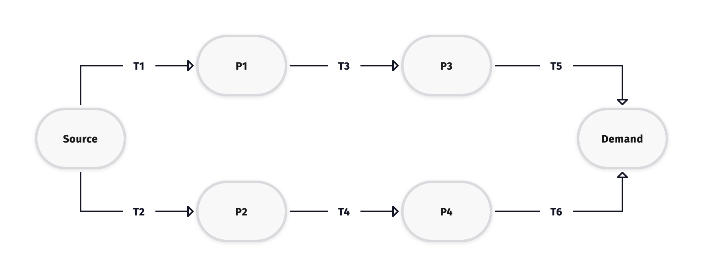
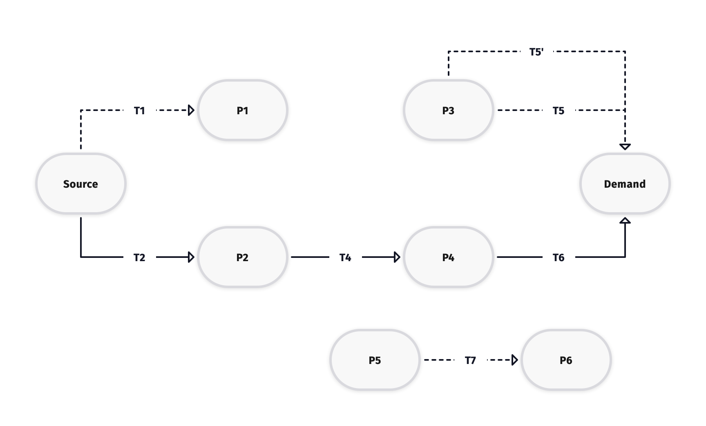

Commodity Network
=================

This dcumentation segment highlights some of the concerns regarding the integrity of
the commodity flow network within Temoa.  The modeler is advised to be aware of how
Temoa processes flow of energy within an energy system and how escapes in network
integrity can lead to erroneous results.

Network Flow
------------

In a standard, static, and lossless ``s-t`` network, flow balance constraints fall into
place naturally.  The input flow at the source, ``s`` is set to equal the output flow
at termination point ``t`` and for all intermediary nodes, flow in is constrained to
equal flow out.  Temoa's energy network, however, is not static and has losses in the form
of efficiency losses within the ``tech`` processes that serve as the links between the
``commodity`` nodes.  When a model is solved over several time periods with "perfect foresight"
the network may look quite different in each region and time period based on endogenous selections
of new technologies, lifetime expirations, etc.  This problem is compounded when running the
model myopically where previous non-selections remove options from the decision space in future
periods, outside of the modeler's control.

When developing data for a model to run with perfect foresight, or any of the more advanced modes,
it is incumbent upon the modeler to provide the vintages, technologies, lifespans, etc. in order
to allow Temoa to build a proper network.  Some explanation of how Temoa balances flow is in order
to help avoid pitfalls....

The energy network in each region and period is built dynamically from the techs that are
identified as existing capacity and whatever the model has ability to build from elements in
the optimization window identified in the ``Efficiency`` table.  In order enforce conservation of
flow constraints, the model identifies output flows (commodities), including the demand
commodities and inventories all possible techs (existing or available) that *could* produce that commodity from
any input commodity and enforces flow balance, so that *some tech* must provide the flow to support that output.
This is the basis for satisfying demands at the termination of the network.  

If at any point along the chain there are no techs
available to produce the commodity in question, the model *assumes this is a base or source commodity* for
flow balance purposes, which can lead to some intermediate physical commodities erroneously being
provided to the model freely without a preceding processing chain if there is not one avaialbe.
This can inadvertently come about from a variety of causes including:

* Failure to provide a linking technology in any region-period
* A technology that expires in a particular period with no replacement/alternate pathway provided
* Non-selection in a prior myopic period

These failures can be difficult to diagnose in large models with many periods/regions/technologies and serve
as the motivation to provide source-tracing (described in the next section) to help enforce network integrity.

Source Tracing
--------------

Source tracing from Demand back to a labeled "source" capacity is now available in Version 3.0+ of Temoa.
The model can provide a check for network integrity on a built model before solve is initiated.  Currently,
discrepancies are noted in the log file for the model.  The general intent is to ensure that all flows to Demand
commodities can be cleanly traced back to original sources.  Consider the simple network below with one source, one
demand, and intermediate physical commodities ``{P1, P2, P3, P4}`` and the connective technologies ``T1``
through ``T6``.  This well-connected network works as intended and the singular demand is traceable via either path
back to source.

A defective network (shown below) may occur for a several reasons, as cited in the previous section.  Suppose that
for some reason `T3` is no longer available in this or a subsequent period (never made available, lifetime
expiration earlier than other links, not selected by myopic process--which would normally remove the other links
as well, unless they had replacement vintages and ``T3`` did not, etc.)  Several problems now exist:

1.  Supply side orphans.  Technology ``T1`` is now a "supply side" orphan, which shouldn't cause model problems, but represents bloat
in the model.  Temoa does screen for unused outputs (like ``P1`` in this case) that are not used by other
processes and are not end demands, but it is currently only done 'globally' in all periods/regions.  Resultantly,
this would not trigger a model error.  These will now generate **DEBUG** level log entries with source tracing.  It *could* be a source of unbounded behavior in the case where the
modeler attempts to use negative values for costs.  

2.  Technology ``T5`` and perhaps a now-available new vintage ``T5'`` are now "demand-side" orphans.  These are
problematic and will generate **ERROR** level log entries by source tracing because they would allow a false supply of ``P3`` as
their inputs.

3.  New technology ``T7`` (and any other linkages that are not reachable from either source or demand)
are complete orphans.
They will generate a **DEBUG** level log entry during source tracing.

Note:  **DEBUG** level log entries are normally suppressed, but can be logged by adding the ``-d`` flag to the end
end of the run command

Tech Suppression
---------------
The source-tracing described above currently is performed on a built model and utilizes an internal index of 
active technologies to perform the screening described.  *Prior* to model construction, the loading process will
assess all technologies globally for unused outputs in the optimization window.  For myopic runs, this process
is performed on technologies within the myopic window.  In the general case, it is globally applied.  This first
step suppresses technologies that have no possible use (and would generate errors within the model code) that
are identified by having an output commodity that is neither a demand nor consumed as an input.  These 
technologies are noted by an **INFO** level logging entry that they have been SUPPRESSED, implying that the
data for them is excluded from model generation.

This screening prevents model errors and helps to reduce the size of the model in some cases.  These processes
with non-utilized outputs may be the result of erroneous data (perhaps a technology to produce liquid hydrogen
before there is a user of same) or via myopic actions were a technology in a chain is not selected for build,
rendering other processes in the chain irrelevant in a later period.